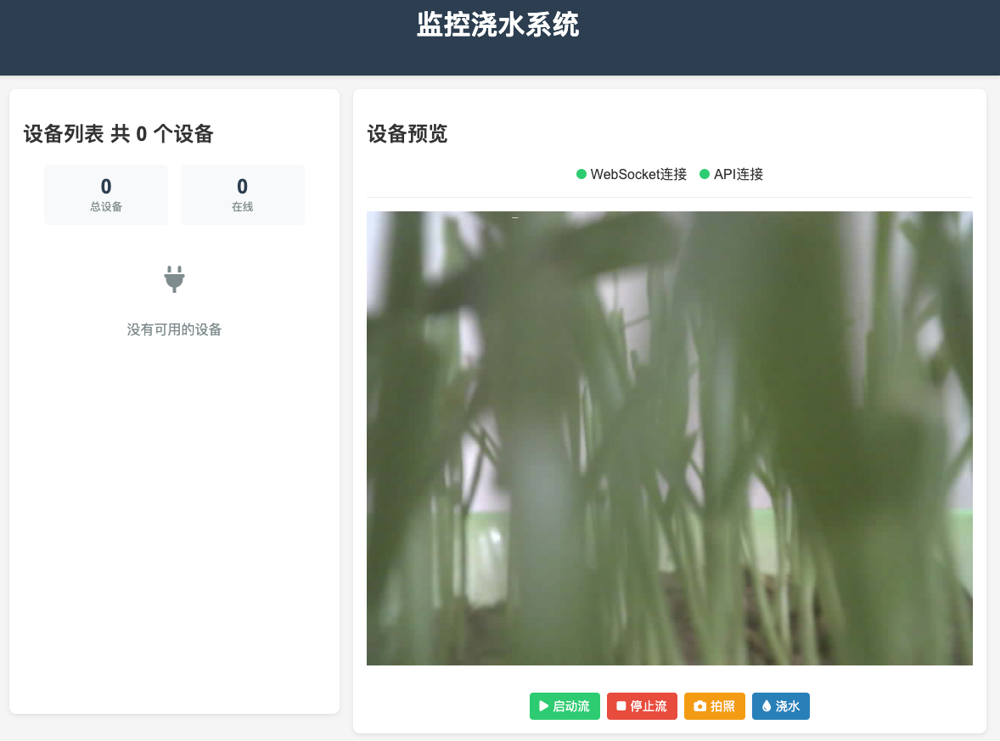

# 远程监控浇水系统

本项目是一个基于 **ESP32-CAM** 和 **Django Channels** 的远程监控浇水系统，支持视频流、拍照、土壤湿度监测以及远程浇水功能。



## 项目结构

### 主要功能模块

- **ESP32-CAM**: 负责视频流、拍照、土壤湿度监测和浇水控制。
- **Django Channels**: 实现 WebSocket 通信，支持实时数据传输。
- **前端页面**: 提供设备监控和控制界面。

## 快速开始

### 环境要求

- Python 3.9
- ESP32-CAM 开发板

### 安装依赖

1. 安装 Python 依赖：
   ```bash
   pipenv install
   ```

2. 安装 ESP32-CAM 所需库：
   - 在 Arduino IDE 中安装以下库：
     - `WiFi`
     - `WebSocketsClient`
     - `ArduinoJson`
     - `esp_camera`

### 配置项目

1. 修改 ESP32-CAM 的 WiFi 和 WebSocket 配置：
   ```ino
   const char* ssid = "YourWiFiSSID";
   const char* password = "YourWiFiPassword";
   const char* ws_server = "YourServerIP";
   const uint16_t ws_port = 8989;
   const char* ws_path = "/ws/esp32-cam/";
   ```

### 启动项目

1. 启动 Django 项目：
   ```bash
   daphne -b 0.0.0.0 -p 8989 sinica.asgi:application
   ```

2. 上传 `ESP32-CAM.ino` 到开发板。

3. 访问前端页面：
   - 打开浏览器，访问 `http://<服务器IP>:8989`。

## 项目功能

### 设备监控

- 实时查看设备状态（在线/离线）。
- 显示土壤湿度数据。

### 视频流与拍照

- 启动/停止视频流。
- 远程拍照并查看图像。

### 土壤湿度监测

- 获取土壤湿度数据（模拟值和数字值）。

### 浇水控制

- 远程启动浇水功能，支持自定义浇水时长。

## 文件说明

### 后端

- `sinica/`: Django 项目主目录。
- `fatcat/`: 应用模块，包含视图、路由、WebSocket 消费者等。
- `requirements.txt`: 项目依赖列表。

### 前端

- `fatcat/templates/fatcat/index.html`: 前端页面。

### ESP32-CAM

- `esp32-cam/ESP32-CAM.ino`: ESP32-CAM 的固件代码。
- `esp32-cam/camera_pins.h`: 摄像头引脚配置。

## 技术栈

- **后端**: Django, Django Channels
- **前端**: HTML, CSS, JavaScript
- **硬件**: ESP32-CAM
- **通信**: WebSocket
